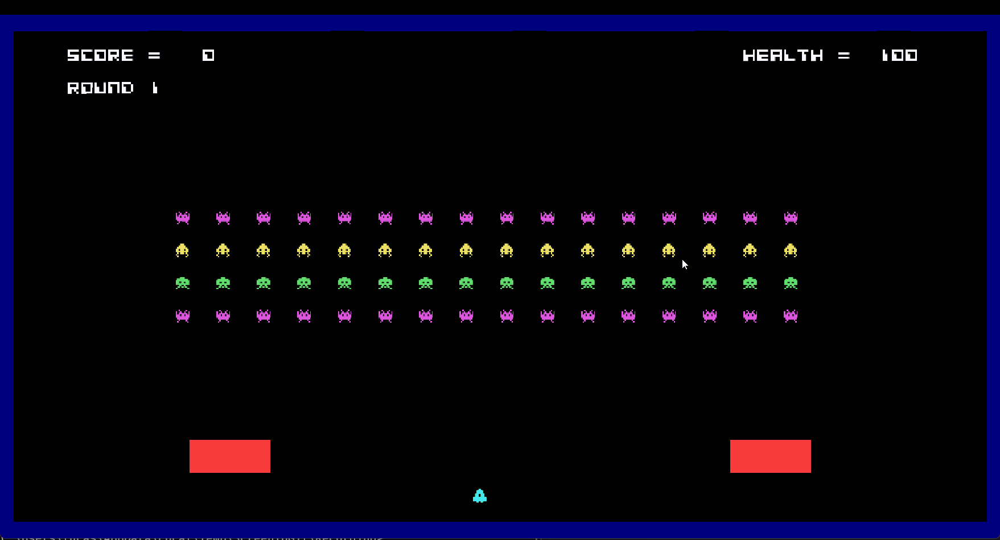

## LDTS_l04_gr03 - Space Invaders

This project is a re-adaption of the classical game Space Invaders, released in 1978 for the arcade video game machines and later to other platforms.
The objective is to defeat a wave of descending aliens with a horizontally moving laser and earn as many points as possible by killing them and stop the invasion.

The player controls a spaceship that can shoot lasers. The game ends when the player is shot and has no lives left. The player can also collect some power ups that can help him.

### Project Main Goals

The project uses some of the Design Patterns learned during the classes and emphasizes the code organization and testing, rater than making the most sophisticated game possible.
Therefore, the main goals of this game are the testing and design of the code.

### GAME CONTROLS

- **Menus**
    - **Menu Navigation** - Up and Down arrow Keys;
    - **Menu Selection** - Enter Key;
    - **Exit from Leaderboard and Instructions Menus** - Escape Key.

- **Game**
    - **Shoot** -  Up Arrow key;
    - **Move** -  Left and Right Arrow Keys;
    - **Pause Game** - Escape Key.

### Game Screenshot
  

