## LDTS_l04_gr03 - Space Invaders

This project is a re-adaption of the classical game Space Invaders, released in 1978 for the arcade video game machines and later to other platforms.
The objective is to defeat a wave of descending aliens with a horizontally moving laser and earn as many points as possible by killing them and stop the invasion.

The player controls a spaceship that can shoot lasers. The game ends when the player is shot and has no lives left. The player can also collect some power ups that can help him.

**Stop the invasion and have fun!!!**

This project was developed by:

- **Lucas Faria** (up202207540)
- **Francisco Magalhães** (up202007945)
- **Rodrigo Sousa** (up202207292)

  LDTS 2023⁄24  
  Software Design and Testing Laboratory

### IMPLEMENTED FEATURES

- **Playable Character** - The playable character is a spaceship. The player controls its movements by pressing the right and left arrow keys.

- **Enemy Characters** - The enemy characters are aliens that want to invade the planet. They can shoot lasers and kill the player. They can also move from left to right and when they hit the wall they move from right to left and vice-versa.

- **Cover Walls** - Walls that protect the player from the enemy lasers.

- **Lasers** - Both aliens and the player can shoot lasers.

- **Arena** - The place were the player and the aliens fight.

- **Collision Detection** - The game detects if a laser collided with an alien or a player. It may also detect if a laser collided with a cover wall and if an aliens or the player collided with the arena walls. Other important thing the game needs to detect is the collision of the aliens with the cover walls because in that case the game ends.

- **Main Menu** - The game Main Menu is accessed at the beginning of the game. It can also be accessed through the Pause menu and Game Over menu.
  It as the following options:
    - **Play** - Starts the game;
    - **Leaderboard** - Shows the best scores;
    - **Instructions** - Displays the game instructions;
    - **Exit** - Exists the game.

- **Pause Menu** - Can be accessed pressing the escape key. It as the following options:
    - **Continue** - Resumes the game;
    - **Instructions** - Displays the instructions;
    - **Restart** - Restarts the game;
    - **Exit** - Returns to the main menu.

- **Game Over Screen** - Is accessed when the player dies. It as the following options:
    - The player can type his name and insert his score into the leaderboard;
    - **Restart** - Restarts the game;
    - **Leaderboard** - Displays the top 5 best scores;
    - **Exit** - Exits the game.
  

### Screen Shots

  - ### **Game**:

  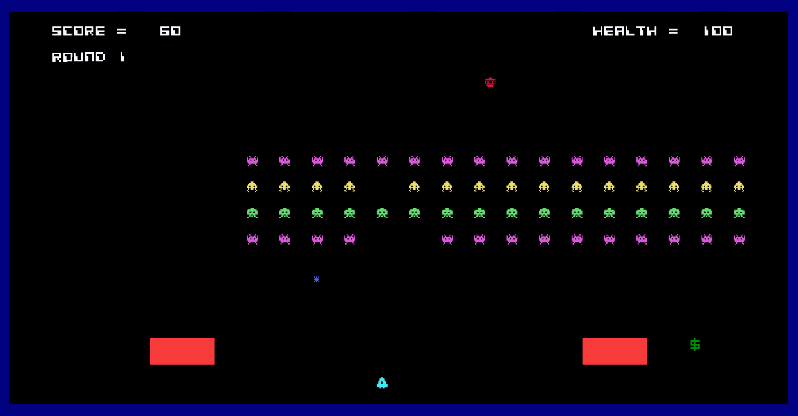

  - ### **Start Menu**:

  

  - ### **Pause Menu**:

  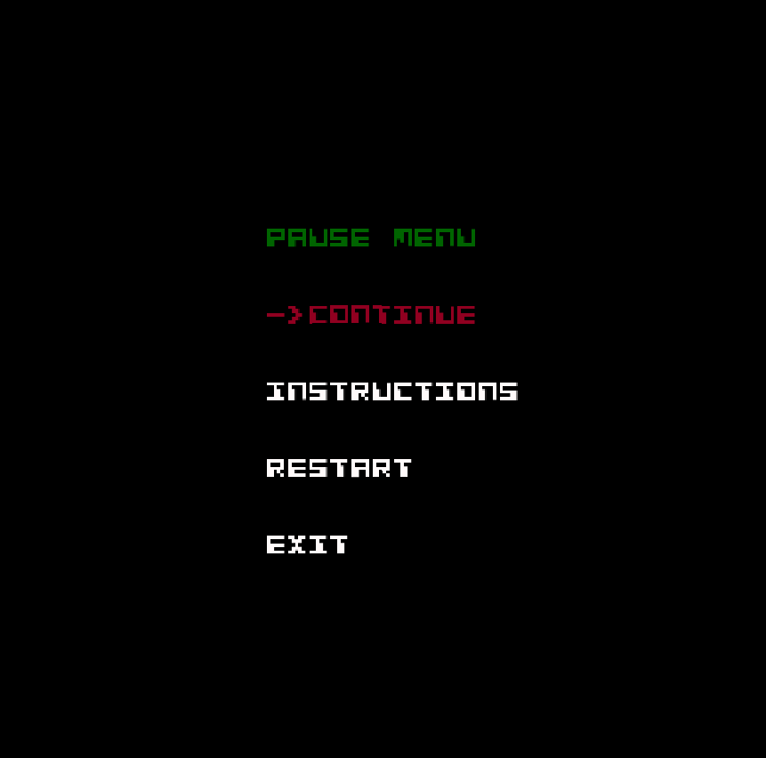

  - ### **GameOver Menu**:

  

  - ### **Instructions Menu**:

  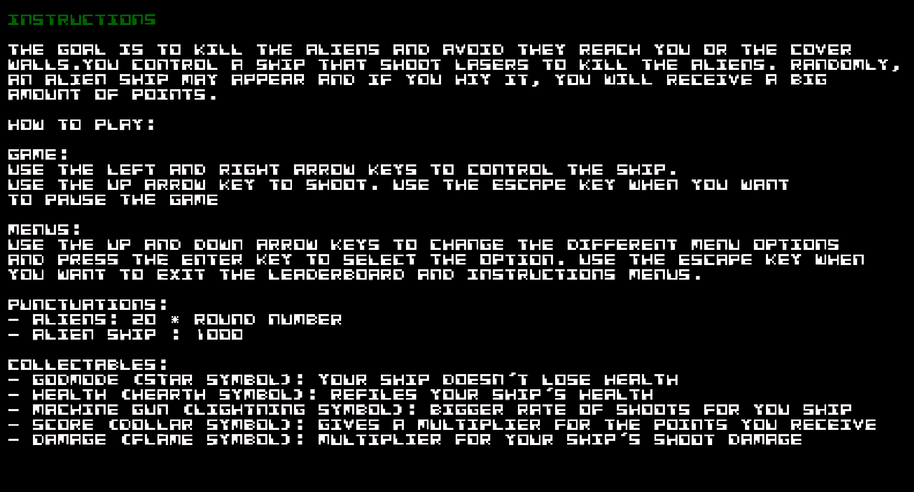

  - ### **Leaderboard**:

  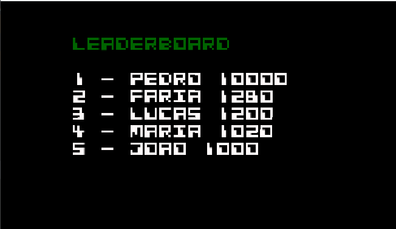

  

### PLANNED FEATURES

- **Enemy Spaceship** - Sometimes, the aliens spaceship appears and moves from left to right or from right to left. If the player hits this spaceship, he will receive a bonus punctuation.

- **Collectable Lives** - The player can extend his lives by collecting this collectable.

- **Collectable Projectiles** - This collectables can help the player by given him the option to shoot special projectiles.

  **Collectable lives** and **Projectile** appearance:

- **Background Music** - Music that plays when the game starts.

- **Sound Effects** - Sound of the lasers and collisions.

- **Better Aliens Animation** - Aliens have an animation when moving

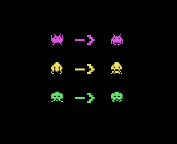

- **Cover Walls Destruction**- Cover walls can be destructed and have different looks depending on the damage

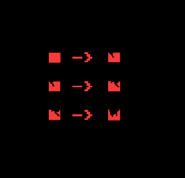
### DESIGN

### Structure

- **Problem in Context.** The game is complex, and so we need to organize the code the best way possible. The structure needs to be simple and easy to read in order to facilitate the maintenance and the ability to improve and add features to the game.

- **The Pattern.** The MVC pattern is the best choice for this. It divides the code in three parts: 
  - **Model** - Contains the data and logic of the game;
  - **View** - Displays the model data and receives the users inputs;
  - **Controller** - Provides the model data to the view and interprets the actions.
  

- **Implementation.** The pattern allowed us to divide the code in at least this four parts:
  - **Model** - Basic logic and data of every element of the game (Spaceship, Aliens, etc...); 
  - **Viewer** - Displays tha data of each model ("draws" the character);
  - **GUI** - Controls the graphics and receives the inputs. It´s basically an extension of the Viewer but more specialized into using the Lanterna framework.
  - **Controller** - Controls the logic of the program. Decides the next step by interpreting the inputs and gives to the Viewer the Model data.

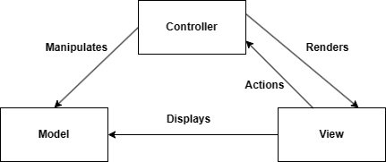

- **Consequences.** This type of implementation forces us to specify from very early in the game development the different classes and structures that we are going to use.
This can be a challenge specially if we are not sure about what features we want to add to the game. The code needs to be very organized since the beginning. 

### States

- **Problem in context.** The game needs to have several states, such as the main menu, the pause menu, the game itself, etc.
This leads us to the necessity of having a simple and organized way to handle the different states.

- **The Pattern.** The state pattern is the best choice to help us. It allows an object to alter its behavior when its internal state changes. The object will appear to change its class.

- **Implementation.** The code includes a state part that handle the different states.

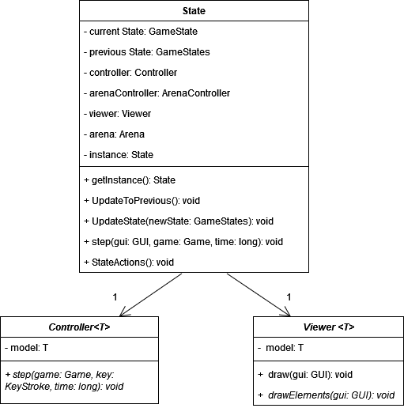

- **Consequences.** The functionality of the game is influenced by the state that it is currently in. Because of that, many features and functionalities are trapped inside a single state.

### Part-Whole Hierarchies

- **Problem in Context.** Some parts/classes of the game are very similar. They share the same code and have similar behaviour in some cases.
Because of that we might end up writing the same code repeatedly.

- **The Pattern.** The composite pattern can help us with that. It can compose objects into tree structures to represent part-whole hierarchies. Composite lets clients treat individual objects and compositions uniformly.

- **Implementation.** Some classes are divides in a part-whole hierarchies, for example the Elements Class.

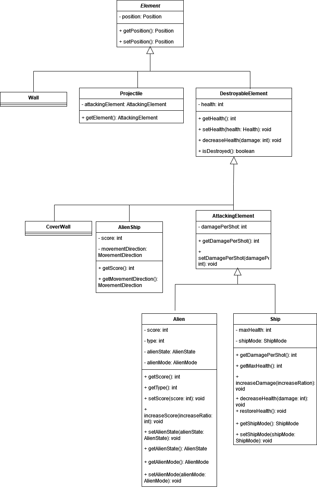

- **Consequences.** The code becomes more simple and organized. It's easier to add new types of components. 
However, the subclasses will always depend on their superclasses, reducing their flexibility. 

### Singleton

- **Problem in Context.** Some classes cannot be initialized more than one time. This could cause serious problems to the program.

- **The Pattern.** The Singleton is the best choice to solve this problem. It ensures that a class only has one instance and provide a global point to access it.

- **Implementation.** Mostly used to ensure that only one Game and State object are instantiated.

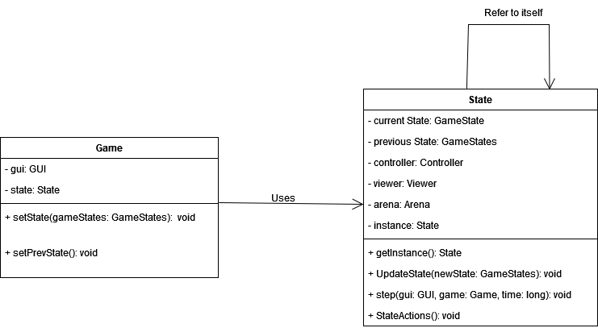

- **Consequences.** It makes the code harder to test. It is also a very specific and limiting pattern and should only be used in certain cases.

### Game Loop

- **Problem in Context.** The game needs to process the inputs without crashing, update the state
and render the graphics. It also needs to track the passage of time to control the rate of gameplay.

- **The Pattern.** The Game Loop Pattern is the best solution to solve this problem. It ensures that the state and the controllers
are updated in each loop.

- **Implementation** Used in the Game class

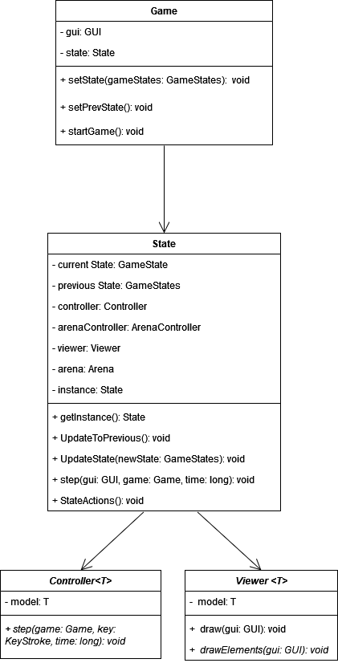

- **Consequences** The game runs more smoothly. However, we need to make sure that the code in the Game Loop
is efficient because that peace of code will run a lot of times during the Game execution. Bad code will result in bad game performance.

### Command

- **Problem in Context.** Some classes are only differentiated by the actions they execute. Therefore, is necessary to find a way to organize them in a correct way.

- **The Pattern.** The Command Pattern is the solution to this problem. With this pattern, objects are parameterized by an action they perform.

- **Implementation.** Is used in the collectables to execute their specific actions.

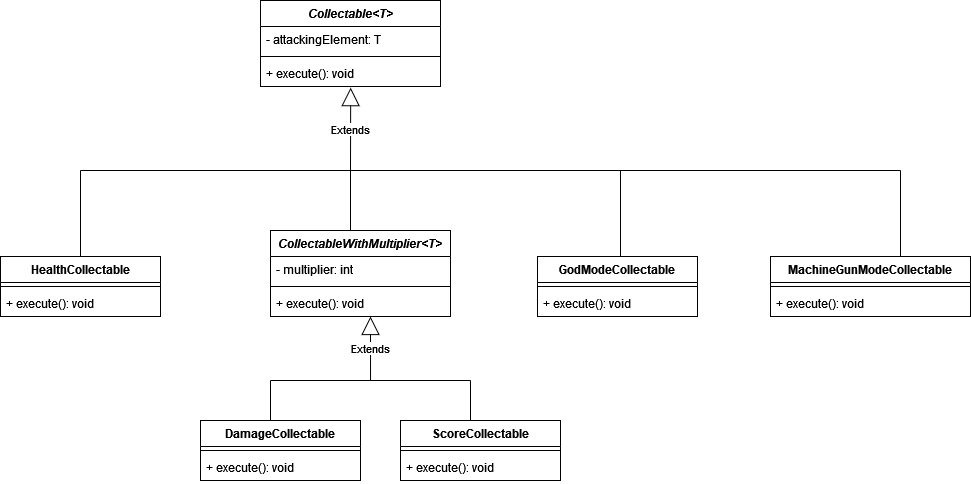

- **Consequences.** It decouples the object that invokes the operation from the one that knows how to perform it and 
facilitates the addition of new commands.

### Collectable Factory

- **Problem in Context.** The game has several collectables, and they need to be created in an organized manner. Each collectable has a type, and we need to create the collectable object accordingly to the type.

- **The Pattern.** The Factory Pattern is the best choice to solve this problem. It allows to have a "factory" class that creates the collectables accordingly to their type without specifying specifically the class we want to instantiate.

- **Implementation.** Used with the collectables.

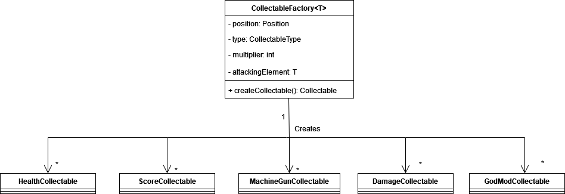

- **Consequences.**  The code becomes easier to reuse and maintain. It also becomes more modular and enables the creation of objects without knowing the implementation details. 

### TESTING

- Screenshot of coverage report.
- Link to mutation testing report.

### SELF-EVALUATION

- **Lucas Faria**: 45%
- **Francisco Magalhães**: 45%
- **Rodrigo Sousa**: 10%
